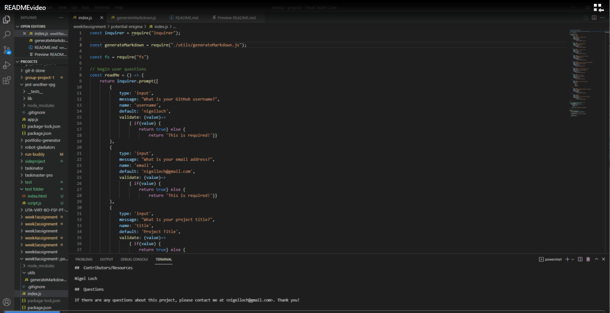

#  Budget Tracker

##  Description

This application allows a user to track their expenditures as well as their deposits. This is a PWA app that allows the user to use it when not connected to the internet. Once the device reconnects to the web, the amounts entered whil offline are uploaded and maintained.

##  Table of Contents
* [Installation](#installation)
* [Usage](#usage)
* [Tests](#tests)
* [License](#license)
* [Contributors/Resources](#contributors)
* [Questions](#questions)

##  Installation

No installation required. The application can be accessed at: https://warm-sierra-26477.herokuapp.com/

##  Usage

<<<<<<< HEAD
User will enter the name of the transaction and the amount while both online and offline.
=======

Please see the provided video found [here](./utils/READMEvideo.webm)
>>>>>>> 61abadc4296479ad3ea694990b9c8331c2ad1dfe

##  Tests

No testing was performed

##  License

MIT

##  Contributors/Resources

Nigel Loch 
* Lorem Ipsum Generator <https://loremipsum.io/> 
* License Badges <https://shields.io/>

##  Questions

If there are any questions about this project, please contact me at <nigelloch@gmail.com>. 

To see more of my projects, please visit my GitHub Repo [here](https://github.com/nigelloch?tab=repositories). Thank you! 

  
